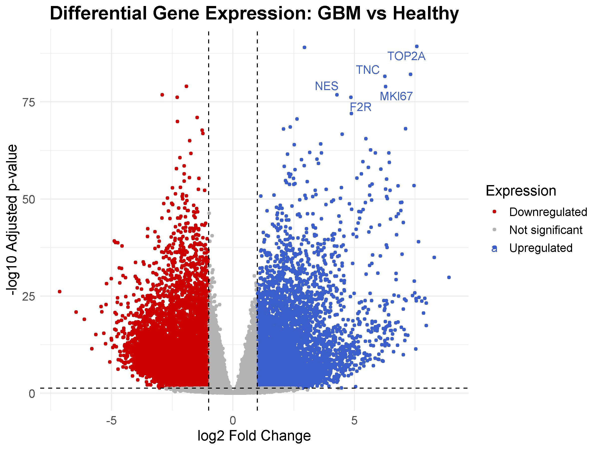
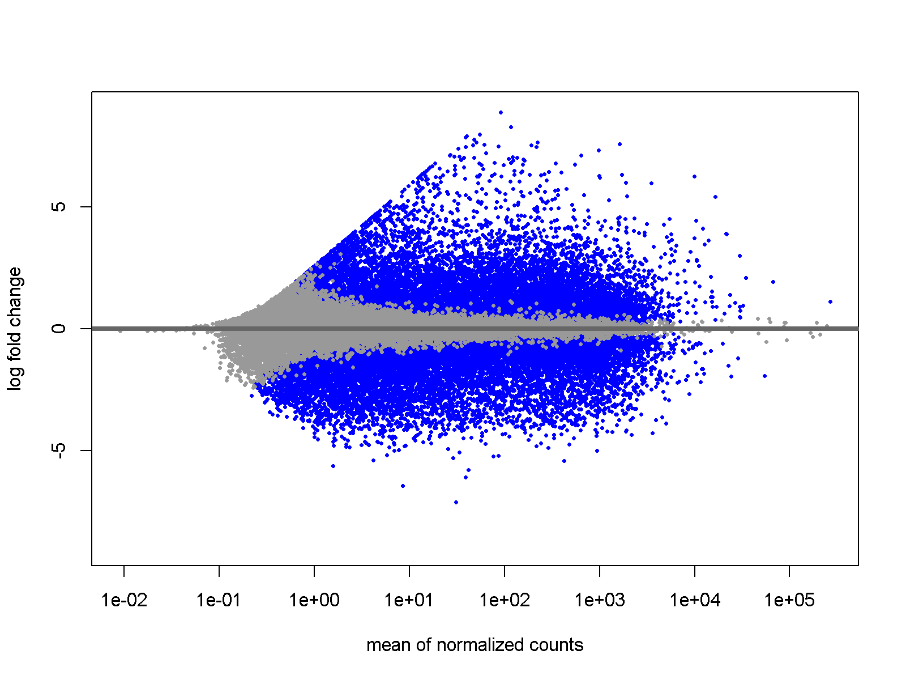
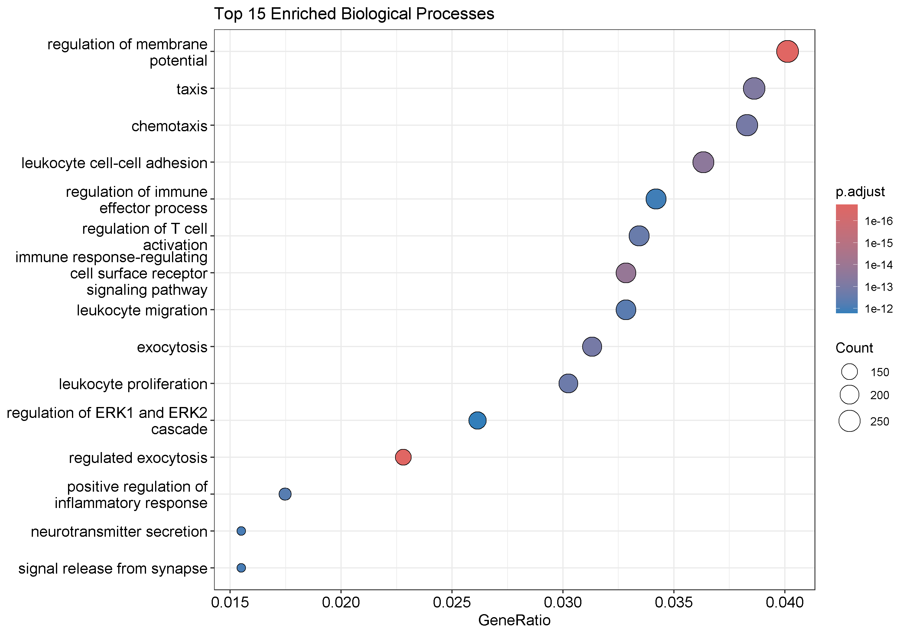
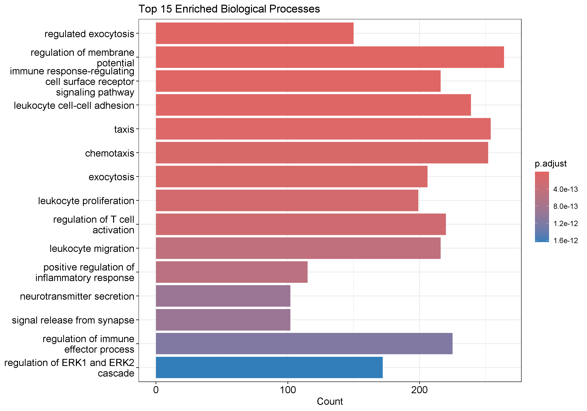
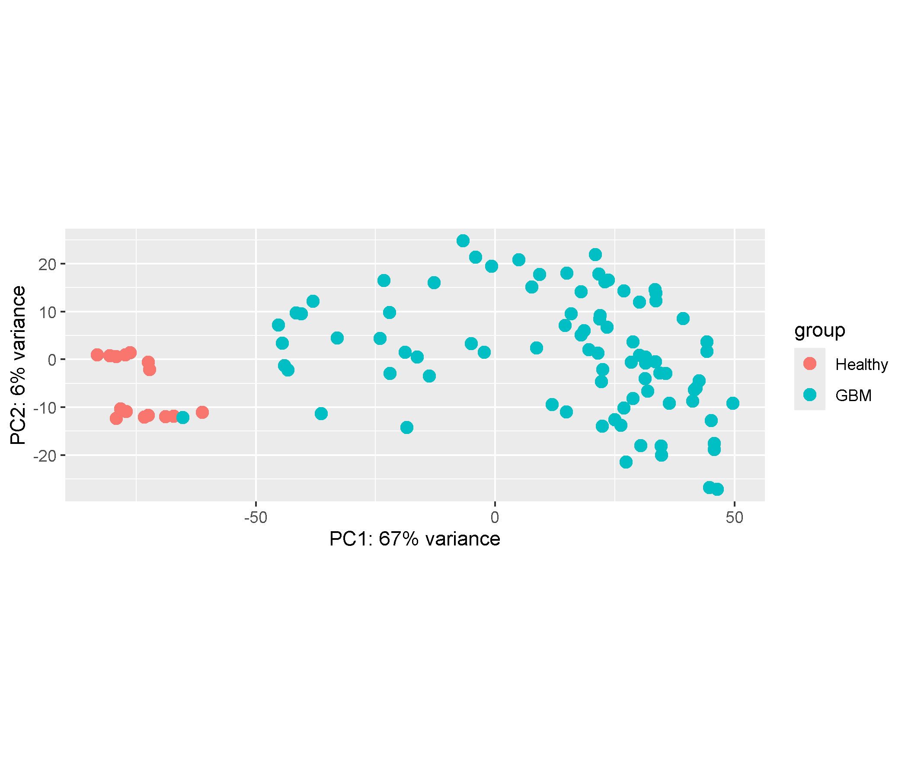

# Bulk RNA-seq Analysis of Glioblastoma (GBM)


---

# Project Overview

This project presents a complete **Bulk RNA-seq differential gene expression analysis workflow** performed in **R** using the **DESeq2** package from **Bioconductor**.

The aim of the project was to identify genes differentially expressed between **healthy brain tissue** and **glioblastoma (GBM)** samples and to investigate the biological processes associated with these changes.

The workflow includes differential expression analysis, Gene Ontology enrichment analysis, Principal Component Analysis (PCA), and visualization of gene expression patterns.

---

# Analysis Pipeline

```text
                 GSE147352 (GEO)
                        │
                        ▼
              Raw count matrix (.tsv)
                        │
                        ▼
             Sample metadata (GEOquery)
                        │
                        ▼
              Data preprocessing
        (sample filtering & annotation)
                        │
                        ▼
         Differential Expression Analysis
                   (DESeq2)
                        │
        ┌───────────────┼────────────────┐
        ▼               ▼                ▼
    MA Plot       Volcano Plot      Significant Genes
                                         │
                                         ▼
                            Gene Ontology Enrichment
                                         │
                          ┌──────────────┴─────────────┐
                          ▼                            ▼
                    GO Dotplot                  GO Barplot
                                         
                        │
                        ▼
     Variance Stabilizing Transformation (VST)
                        │
              ┌─────────┴─────────┐
              ▼                   ▼
             PCA              Heatmap
```

---

# Biological Question

**Which genes and biological processes are significantly altered in glioblastoma compared with healthy brain tissue?**

---

# Dataset

| Information | Value |
|-------------|-------|
| Database | Gene Expression Omnibus (GEO) |
| Accession | GSE147352 |
| Organism | *Homo sapiens* |
| Data type | Bulk RNA-seq |
| Analysis | Differential Gene Expression |

Dataset:

https://www.ncbi.nlm.nih.gov/geo/query/acc.cgi?acc=GSE147352

---

# Bioinformatics Workflow

- Load raw count matrix
- Download sample metadata from GEO
- Prepare sample metadata
- Differential gene expression analysis using DESeq2
- Gene annotation
- Identification of significantly differentially expressed genes
- MA Plot
- Volcano Plot
- Gene Ontology (GO) enrichment analysis
- GO Dotplot
- GO Barplot
- Principal Component Analysis (PCA)
- Heatmap visualization

---

# Technologies

- R
- Bioconductor
- DESeq2
- GEOquery
- AnnotationDbi
- org.Hs.eg.db
- clusterProfiler
- enrichplot
- ggplot2
- ggrepel
- pheatmap

---

# Results

## Volcano Plot

The volcano plot displays significantly differentially expressed genes between healthy brain tissue and glioblastoma samples. Genes on the right side are upregulated in GBM, whereas genes on the left side are downregulated. Dashed lines indicate the statistical significance thresholds.



---

## MA Plot

The MA plot presents normalized gene expression changes across all analyzed genes. It provides an overview of differential expression after normalization and statistical testing.



---

## Gene Ontology Dotplot

The GO dotplot presents the most significantly enriched biological processes identified among differentially expressed genes.



---

## Gene Ontology Barplot

The GO barplot summarizes the top enriched Gene Ontology Biological Processes ranked according to statistical significance.



---

## Principal Component Analysis (PCA)

Principal Component Analysis demonstrates a clear separation between healthy brain tissue and glioblastoma samples based on global gene expression profiles.



---

## Heatmap

The heatmap illustrates expression patterns of the top 30 differentially expressed genes and demonstrates distinct clustering between healthy and glioblastoma samples.


---

# Main Findings

The analysis identified numerous genes significantly dysregulated in glioblastoma compared with healthy brain tissue.

Gene Ontology enrichment analysis revealed enrichment of biological processes associated with:

- Immune response
- Leukocyte migration
- Chemotaxis
- Exocytosis
- Regulation of membrane potential

Principal Component Analysis clearly separated healthy and glioblastoma samples.

The heatmap confirmed distinct expression patterns among the most significantly differentially expressed genes.

---

# Skills Demonstrated

This project demonstrates practical experience with:

- Bulk RNA-seq data analysis
- Differential gene expression analysis
- DESeq2 statistical workflow
- Gene annotation
- Gene Ontology enrichment analysis
- Principal Component Analysis (PCA)
- Heatmap visualization
- Scientific data visualization in R
- Reproducible bioinformatics workflows
- Git & GitHub project organization

---

# Future Improvements

Possible extensions of this project include:

- Gene Set Enrichment Analysis (GSEA)
- KEGG pathway enrichment analysis
- Protein-protein interaction (PPI) network analysis
- Survival analysis using TCGA clinical data
- Validation using an independent RNA-seq dataset

---

# Repository Structure

```text
Bulk-RNAseq-Glioblastoma-DESeq2
│
├── data
│   └── counts
│
├── docs
│
├── figures
│   ├── Volcano_plot.png
│   ├── MA_plot.png
│   ├── GO_dotplot.png
│   ├── GO_barplot.png
│   ├── PCA_plot.png
│   └── heatmap_top30_genes.png
│
├── results
│   ├── Significant_genes_GBM_vs_Healthy.csv
│   └── GO_BP_results.csv
│
├── scripts
│   └── 01_bulk_rnaseq_analysis.R
│
├── .gitignore
├── LICENSE
└── README.md
```

---

# Author

**Katarzyna Zielińska**

Bioinformatics Portfolio

2026
